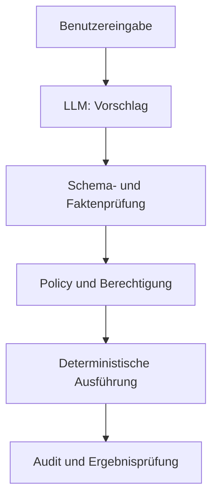

# M01 — LLM & Transformer Foundations

## 1. Kurze Vorstellung

Dieses Modul schafft das technische Arbeitsmodell, das für alle späteren Module benötigt wird:

```text
Text → Tokenisierung → Embeddings + Position
     → Transformer / Self-Attention → Logits
     → Decoding / Sampling → nächstes Token
```

Der Anspruch ist Engineering-Niveau, nicht die Reproduktion eines vollständigen Foundation Models. Nach dem Modul sollst du ein LLM als probabilistische Komponente korrekt einordnen können: Es erzeugt Vorschläge aus einer kontextabhängigen Wahrscheinlichkeitsverteilung. Deterministische Validierung, Policy, Berechtigungen und Transaktionsgrenzen bleiben außerhalb des Modells.

Das Modul ist auf erfahrene Software Engineers zugeschnitten. Python wird nur als transparentes Laborwerkzeug verwendet; die Experimente implementieren keine produktionsfähige Tokenizer-, Attention- oder Modellbibliothek.

### Leitfrage

> Was passiert technisch zwischen Eingabetext und nächstem Token — und welche Systemgrenzen folgen daraus?

### Lernziele

Nach Abschluss kannst du:

- Token, Token-ID, Embedding und Positionsinformation unterscheiden;
- Self-Attention mit Query, Key und Value mathematisch und anschaulich erklären;
- Context Window, Kontextbudget und Informationsverlust auseinanderhalten;
- Training, Inference, Parameter, Gewichte und Aktivierungen unterscheiden;
- Logits, Softmax, Temperature, Top-k und Top-p erklären;
- Varianz und Nichtdeterminismus experimentell sichtbar machen;
- Halluzinationen als Systemrisiko analysieren, ohne sie mystisch zu behandeln;
- entscheiden, welche Prozessschritte deterministisch bleiben müssen;
- LLM-Ausgaben als untrusted proposals in eine sichere Architektur einordnen.

## 2. Voraussetzungen und Ablauf

Vorausgesetzt werden Software-Engineering-Grundlagen, lineare Algebra auf Vektorebene und die Fähigkeit, kleine Python-Skripte auszuführen. Für das Labor genügt Python 3.10 oder neuer; zusätzliche Pakete sind nicht erforderlich.

Empfohlener Ablauf für 8–10 Stunden:

1. README und die fünf Konzepte lesen.
2. `examples/llm_foundations_lab.py` ausführen und die Ausgabe prüfen.
3. Übungen 1–5 in Reihenfolge bearbeiten.
4. Die eigene Erklärung und die Messergebnisse unter `evidence/` ablegen.
5. Erst danach die Referenzlösungen öffnen und Abweichungen dokumentieren.

Die sechs Übungen bauen aufeinander auf. Übung 06 ist die Syntheseprüfung und verbindet alle Kapitel mit einer realistischen, kontrollierten Automatisierungsaufgabe.

## 3. Lerninhalte

Die eigentlichen Lerntexte liegen in [`lessons/`](lessons/). Sie bilden den roten Faden des Moduls und werden durch Beispiele, Übungen und Evidence ergänzt.

| Kapitel | Inhalt | Ergebnis |
|---|---|---|
| [00 — Orientation](lessons/00-orientation.md) | Systemmodell und Lernstrategie | LLM korrekt als probabilistische Komponente einordnen |
| [01 — Tokens](lessons/01-tokens-and-tokenization.md) | Tokenisierung, IDs und Kosten | Tokenbudget und Tokenizer-Risiken erklären |
| [02 — Embeddings](lessons/02-embeddings-and-representations.md) | Vektorräume und Position | semantische Repräsentation von Indexdaten unterscheiden |
| [03 — Transformer](lessons/03-transformer-and-attention.md) | Q/K/V, Attention, Multi-Head | Attention rechnerisch und architektonisch erklären |
| [04 — Context](lessons/04-context-and-memory.md) | Window, Budget und Gedächtnis | Kontextauswahl deterministisch planen |
| [05 — Inference](lessons/05-training-inference-decoding.md) | Training, Logits und Decoding | Sampling und Varianz messen |
| [06 — Reliability](lessons/06-hallucinations-and-limitations.md) | Halluzinationen und Grenzen | Fehlermodi und Gegenmaßnahmen klassifizieren |
| [07 — Boundaries](lessons/07-engineering-boundaries.md) | Systemgrenzen und Sicherheit | LLM in eine kontrollierte Architektur integrieren |

Jedes Kapitel enthält Begriffe, ein mentales Modell, technische Details, eine Engineering-Folge und einen kurzen Selbsttest.

## 4. Kernkonzepte

### 3.1 Tokenisierung

Ein Token ist eine diskrete Einheit des verwendeten Tokenizers. Es kann ein ganzes Wort, ein Wortteil, ein Leerzeichen, Satzzeichen oder ein Spezialtoken sein. Token sind nicht gleichbedeutend mit Wörtern und nicht sprachübergreifend stabil. Die Tokenizer-Konfiguration ist deshalb Teil des Modellvertrags.

### 3.2 Embeddings und Position

Eine Token-ID ist nur ein Index. Ein Embedding ist ein dichter Vektor, der während des Trainings gelernt wird. Ähnliche Verwendungsweisen können im Vektorraum nahe beieinander liegen; „Nähe“ ist jedoch eine statistische Eigenschaft des Trainings und keine eingebaute Wahrheit. Da Self-Attention zunächst positionsunabhängig ist, wird zusätzlich Positionsinformation eingebracht.

### 3.3 Self-Attention

Für eine Eingabematrix `X` werden Projektionen gebildet:

```text
Q = XWq    K = XWk    V = XWv
Attention(Q,K,V) = softmax(QKᵀ / √dk + mask) V
```

Query beschreibt, wonach eine Position sucht, Key womit sie verglichen wird, und Value welche Information übernommen wird. Die Metapher ist ein Arbeitsmodell; in realen Modellen entstehen diese Repräsentationen aus gelernten Projektionen. Multi-Head-Attention führt mehrere solche Projektionen parallel aus.

### 3.4 Context Window

Das Context Window begrenzt, wie viele Tokens ein Modell in einem einzelnen Inference-Schritt berücksichtigen kann. Es ist weder ein dauerhaftes Gedächtnis noch eine Garantie, dass jedes Token gleich stark genutzt wird. Mehr Kontext erhöht häufig Kosten und Latenz und kann relevante Information durch irrelevante oder widersprüchliche Inhalte entwerten.

### 3.5 Training und Inference

Beim Training werden Modellparameter anhand vieler Beispiele angepasst. Bei der Inference bleiben die Parameter normalerweise unverändert; das Modell berechnet aus Input, aktuellem Zustand und Decoding-Konfiguration eine Ausgabe. Prompt-Inhalte werden nicht automatisch zu dauerhaftem Wissen.

### 3.6 Logits und Decoding

Logits sind rohe Scores für mögliche nächste Tokens. Softmax wandelt sie in eine Wahrscheinlichkeitsverteilung um. Temperature verändert die Schärfe dieser Verteilung; Top-k und Top-p begrenzen die Auswahlmenge. Decoding ist damit ein eigener, messbarer Teil des Systems und nicht bloß eine UI-Einstellung.

### 3.7 Architekturgrenze



Ein LLM darf klassifizieren, extrahieren, formulieren oder einen Plan vorschlagen. Es darf nicht allein eine Berechtigung erteilen, einen destruktiven Seiteneffekt auslösen oder eine Geschäftsregel ersetzen. Diese Grenze verbindet M01 mit M02–M08.

## 5. Durchgängiges Laborbeispiel

Das Labor verwendet einen kleinen, absichtlich vereinfachten Tokenizer, eine manuell definierte Embedding-Matrix, eine einzelne Attention-Schicht und einen kleinen Sampler. Es beantwortet nicht „wie baut man GPT?“, sondern macht die Kausalbeziehungen sichtbar:

```text
"deploy service"
        ↓ toy tokenizer
[deploy, service]
        ↓ embedding lookup
       X
        ↓ Q/K/V + scaled dot-product attention
kontextualisierte Repräsentationen
        ↓ logits + softmax + decoding
      nächstes Token
```

Ausführen:

```bash
python examples/llm_foundations_lab.py
```

Die erwartete Beobachtung steht in [`examples/expected-output.md`](examples/expected-output.md). Die Zahlen sind bewusst klein und nachvollziehbar; sie sind keine Qualitätsaussage über ein reales Modell.

## 6. Trainingserfolg und Acceptance Criteria

Das Modul gilt als bestanden, wenn alle Kriterien mit Evidence belegt sind:

| ID | Acceptance Criterion | Messbarer Nachweis |
|---|---|---|
| M01-AC01 | Token, Token-ID und Embedding werden korrekt unterschieden. | Eigene Erklärung mit zwei Gegenbeispielen; Reviewer-Checkliste vollständig. |
| M01-AC02 | Self-Attention mit Q/K/V und Skalierung wird korrekt erklärt. | Matrixrechnung aus Übung 2 plus Attention-Diagramm. |
| M01-AC03 | Context Window und Context Budget werden korrekt eingeordnet. | Budgetrechnung und begründete Auswahl aus Übung 3. |
| M01-AC04 | Training und Inference werden unterschieden. | Architektur-/Lebenszyklusnotiz aus Übung 1. |
| M01-AC05 | Temperature, Top-k und Top-p werden experimentell verglichen. | Reproduzierbarer Lauf, mindestens 30 Samples pro Konfiguration, Varianz-Tabelle. |
| M01-AC06 | Halluzinationsrisiken werden technisch analysiert. | Fehlerklassifikation mit mindestens vier Ursachen und Gegenmaßnahmen. |
| M01-AC07 | LLM-Grenzen werden in einer Prozessarchitektur korrekt gezogen. | Fünf Prozessschritte klassifiziert; keine direkte Freigabe kritischer Side Effects. |
| M01-AC08 | Der Lernerfolg ist reproduzierbar nachvollziehbar. | `evidence/acceptance-matrix.md`, Laborprotokoll und 10-Minuten-Whiteboard-Check. |

### Bestehens-Gate

- mindestens 7/8 Acceptance Criteria erfüllt;
- M01-AC02, M01-AC05 und M01-AC07 müssen erfüllt sein;
- keine Aussage wie „das Modell weiß es“ ohne Angabe von Datenquelle, Kontext und Unsicherheit;
- alle Experimentwerte enthalten Seed, Konfiguration und Ausführungsdatum;
- offene Punkte werden als Blocker dokumentiert, nicht stillschweigend abgehakt.

## 7. Übungen

Die Aufgaben stehen in [`exercises/`](exercises/):

1. [`01-system-model.md`](exercises/01-system-model.md) — End-to-End-Modell und Lebenszyklus.
2. [`02-attention-by-hand.md`](exercises/02-attention-by-hand.md) — Self-Attention per Hand berechnen.
3. [`03-context-budget.md`](exercises/03-context-budget.md) — Kontextbudget und Informationspriorität.
4. [`04-decoding-experiment.md`](exercises/04-decoding-experiment.md) — Sampling-Varianz messen.
5. [`05-architecture-boundary.md`](exercises/05-architecture-boundary.md) — LLM vs. deterministische Grenze entwerfen.

Referenzlösungen befinden sich in [`solutions/`](solutions/). Sie sind nach dem eigenen Versuch zu lesen.

## 8. Evidence und Review

[`evidence/README.md`](evidence/README.md) beschreibt, welche Dateien abzugeben sind. Evidence ist ein Nachweis des Trainings, keine bloße Zusammenfassung des Lernstoffs. Jede Behauptung soll auf eine Rechnung, einen Lauf, ein Diagramm oder eine begründete Architekturentscheidung zurückverweisen.

## 9. Definition of Done

- [ ] alle sechs Übungen bearbeitet;
- [ ] Labor erfolgreich ausgeführt;
- [ ] mindestens 30 Samples je Decoding-Konfiguration dokumentiert;
- [ ] eigene Attention-Rechnung und Architekturentscheidung vorhanden;
- [ ] Acceptance-Matrix ausgefüllt;
- [ ] 10-Minuten-Whiteboard-Erklärung bestanden;
- [ ] offene Fragen und Abweichungen dokumentiert;
- [ ] Referenzlösungen erst nach der eigenen Bearbeitung verglichen.

## 10. Begriffe, die nach M01 sitzen müssen

`token`, `token id`, `embedding`, `positional information`, `query`, `key`, `value`, `attention score`, `softmax`, `logit`, `context window`, `inference`, `temperature`, `top-k`, `top-p`, `hallucination`, `untrusted proposal`, `deterministic boundary`.
