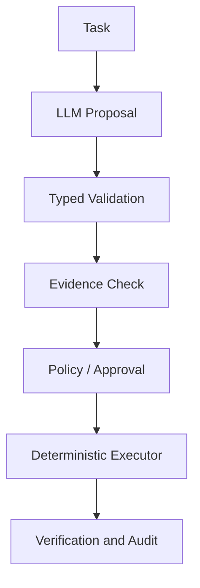

# Kapitel 07 — Die deterministische Engineering-Grenze

## Lernziel

Nach diesem Kapitel kannst du LLM-Fähigkeiten sinnvoll einsetzen, ohne probabilistische Ausgaben zur Sicherheits-, Policy- oder Transaktionsgrenze zu machen.

## 1. Geeignete Aufgaben

LLMs sind häufig nützlich für Sprachverständnis, Klassifikation, Extraktion, Zusammenfassung, Hypothesenbildung, Code-Navigation und Planentwürfe. Der Output sollte als typisierte, überprüfbare Proposal behandelt werden.

## 2. Nicht delegierbare Garantien

Die folgenden Garantien gehören in deterministische Komponenten:

- Identität und Berechtigung;
- Policy-Entscheidungen und Approval;
- Schema-, Typ- und Wertebereichsprüfung;
- Transaktions- und Idempotenzlogik;
- sicherheitskritische oder destruktive Side Effects;
- Audit, Provenance und reproduzierbare Zustandsübergänge.

## 3. Referenzfluss

Jeder Übergang kann ablehnen. Ein LLM erhält nicht dadurch mehr Berechtigung, dass es überzeugend formuliert. Tool-Auswahl und Tool-Autorisierung sind getrennte Entscheidungen.

## 4. Konkretes Deployment-Beispiel

Das Modell darf aus einem Ticket `service=payments`, `environment=staging` und `strategy=rolling` extrahieren. Ein Resolver prüft, ob der Service existiert. Eine Policy prüft Operator, Umgebung und Freigabe. Ein Executor führt den bekannten Prozess aus. Ein Verifier prüft Health und Rolloutstatus. Erst diese Kette macht aus Text eine kontrollierte Aktion.

## 5. Verbindung zum Gesamttraining

M01 liefert das Modellverständnis. M02 typisiert den Proposal-Output, M03 standardisiert die Integrationsgrenze, M04 liefert Evidenz, M05 baut Kontext, M06 orchestriert Muster, M07 misst Qualität und M08 schützt die Policy-Grenze.

## Abschlussfrage

Formuliere für einen beliebigen Prozess einen Satz im Format:

> Das LLM darf `<Vorschlag>` liefern; `<deterministische Komponente>` entscheidet `<Garantie>`; ausgeführt wird erst nach `<Kontrolle>`.

