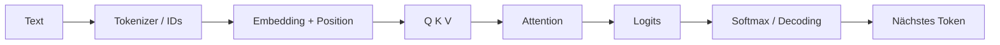

# Lösung 01 — End-to-End-Systemmodell

Beim Training werden Parameter anhand eines Loss angepasst. Bei der Inference werden dieselben Parameter auf einen konkreten Kontext angewendet; Aktivierungen und Wahrscheinlichkeiten werden für diesen Lauf berechnet. Ein Prompt ändert nicht automatisch Gewichte und schreibt kein dauerhaftes Wissen in das Modell. Auch eine korrekte Formulierung ist keine Garantie für Wahrheit, Berechtigung oder Aktualität.
