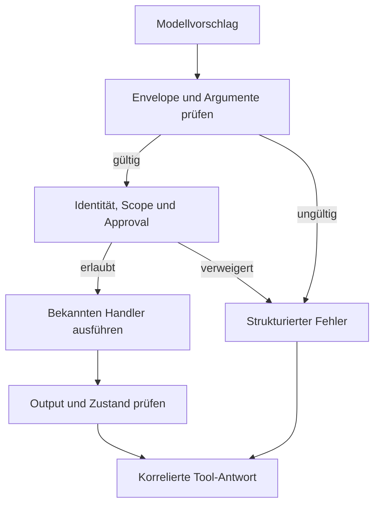

# M02 — Structured Output & Tool Calling

## 1. Einstieg und Modulübersicht

M01 erklärt, warum Modellantworten Vorschläge sind. M02 baut die technische Grenze,
an der daraus kontrollierte Softwareoperationen werden: typisierte Verträge,
Argumentvalidierung, Autorisierung, Ausführung und überprüfte Ergebnisse.

Du entwickelst einen lokalen Issue-Assistenten. Er liest und durchsucht Testdaten,
erstellt und ändert In-Memory-Issues. Ein Löschvertrag wird modelliert, bleibt aber
ausnahmslos gesperrt. Kein Beispiel benötigt API-Schlüssel, ein LLM oder einen
GitHub-Schreibzugriff. Das Labor testet die Ausführungsgrenze; es misst ausdrücklich
nicht die Tool-Auswahlqualität eines echten Modells.

Voraussetzungen: M01 oder gleichwertiges Verständnis, sichere Backend-Entwicklung,
Python 3.10+. Für Java-Engineers: Ein Tool Contract ähnelt einem API-DTO samt
Validierung, Security-Interceptor und Servicevertrag. Die Besonderheit ist der
unzuverlässige, vom Modell erzeugte Aufrufer.

Planungswert: 10–14 fokussierte Stunden einschließlich eigener Implementierung.
Die ursprüngliche Gesamt-Roadmap ist eine Grobschätzung; die Vertiefung braucht
entsprechend mehr Zeit. Wer das Abschluss-Gate vorab erfüllt, dokumentiert
„validated prior knowledge“.

### Verzeichnisse

| Pfad | Zweck |
|---|---|
| [lessons/](lessons/README.md) | Acht aufeinander aufbauende Lernkapitel |
| [examples/](examples/README.md) | Durchgerechnete Verträge, Diagramme und Fehlerabläufe |
| [exercises/](exercises/README.md) | Sechs Aufgaben mit Abgaben und messbaren Kriterien |
| [solutions/](solutions/README.md) | Begründete Musterlösungen und ausführbares Referenzlabor |
| [evidence/](evidence/README.md) | Abnahme, Entscheidungen, Messungen, Test- und Diagrammnachweise |
| [sources.md](sources.md) | Primärquellen und Einordnung der Laborentscheidungen |

## 2. Beispiel und Systemmodell

„Lege ein Ticket für den fehlenden Healthcheck an“ ist zunächst Text. Das Modell
darf daraus `create_issue` mit Titel, Beschreibung und Repository vorschlagen.
Weder die Existenz dieser Funktion noch korrektes JSON erlauben die Mutation.



Ein Vertrag beschreibt Input, Output, fachliche Grenzen und lokale Permission-
Metadaten. Die Policy stammt aus dem vertrauenswürdigen Katalog; ein Modell kann
sie nicht durch `"approved": true` ersetzen.

## 3. Lernpfad

| Reihenfolge | Kapitel | Praktischer Schwerpunkt |
|---|---|---|
| 01 | [Structured Output](lessons/01-structured-output.md) | Syntax, Schema, Semantik und Authority trennen |
| 02 | [JSON Schema](lessons/02-json-schema.md) | Required, optional, null, enum, range, pattern |
| 03 | [Tool Contracts](lessons/03-tool-contracts.md) | Fünf eindeutige Operationen modellieren |
| 04 | [Tool-Calling-Lifecycle](lessons/04-tool-loop.md) | Aufruf und Resultat korrelieren, begrenzt iterieren |
| 05 | [Validation](lessons/05-validation.md) | Mehrstufig prüfen, nicht stillschweigend reparieren |
| 06 | [Policy und Side Effects](lessons/06-policy.md) | READ, WRITE, DESTRUCTIVE, PRIVILEGED |
| 07 | [Retries und Idempotenz](lessons/07-reliability.md) | Doppelte Mutationen und verlorene Antworten |
| 08 | [Tests und Übergabe](lessons/08-testing-and-integration.md) | Negativfälle, Evidence, M03-Anschluss |

Arbeite Kapitel 01–03 mit Übungen 01–02 durch, dann 04–06 mit Übungen 03–04
und schließlich 07–08 mit Übungen 05–06. Öffne die zugehörige Lösung erst nach
deinem eigenen Versuch. Eine zufällig richtige Ausgabe ist kein Kompetenznachweis.

## 4. Labor starten

Alle folgenden Befehle werden **im Modulverzeichnis** ausgeführt:

```bash
cd modules/M02-tool-calling
python3 -m venv .venv
source .venv/bin/activate
python -m pip install -r requirements.txt
python solutions/reference/demo.py
python -m unittest discover -s solutions/reference -p 'test_*.py' -v
```

Unter Windows PowerShell statt `source`: `./.venv/Scripts/Activate.ps1`.
Alternativ die Python-Datei im venv direkt aufrufen; keine Systempolicy lockern.

Installation benötigt Paketdownload; danach sind Demo und Tests offline.
[Laboranleitung und Grenzen](solutions/reference/README.md) erläutert Dateien,
erwartete Zustände und bewusst nicht implementierte Produktionsmerkmale.

## 5. Messbarer Trainingserfolg

| ID | Acceptance Criterion | Nachweis |
|---|---|---|
| AC01 | Vier Garantieebenen korrekt unterscheiden | Übung 01 + Whiteboard |
| AC02 | Fünf Input-/Output-Verträge mit Bounds, Required und unbekannten Feldern | Übung 02, Schema-Tests |
| AC03 | Beschreibungen mit Auswahl- und Nicht-Auswahlkriterien | Übung 02, Auswahlmatrix |
| AC04 | Korrelierter, begrenzter Tool-Lifecycle ohne Text-als-Ausführung | Übung 03 |
| AC05 | Fehlerhafte Inputs und Outputs kontrolliert abweisen | Übung 03, Negativtests |
| AC06 | READ/WRITE/DESTRUCTIVE/PRIVILEGED erklären; Scope und Approval getrennt prüfen | Übung 04 |
| AC07 | Replay, Key-Konflikt, Versionskonflikt und unbekannten Ausgang unterscheiden | Übung 05 |
| AC08 | Strukturierte Resultate ohne Credentials in den Modellkontext überführen | Übungen 03/06 |
| AC09 | Mindestens drei produktionsnah entworfene Tools ausführbar testen | Übung 06 |
| AC10 | Entscheidungen, Testlauf und Grenzen nachvollziehbar dokumentieren | Evidence-Abnahme |

**Alle zehn Kriterien müssen erfüllt sein.** Drei ausführbare Verträge sind das
Roadmap-Minimum; die Referenz implementiert vier lokale Operationen und einen
gesperrten Löschvertrag. „Produktionsnah entworfen“ ist kein Produktionsreife-Siegel.

## 6. Übungen und Referenzlösungen

Die [sechs Übungen](exercises/README.md) verlangen eigene Artefakte, keine Kopien
der Musterlösung. Zu jeder gibt es eine [Referenzlösung](solutions/README.md)
mit Entscheidungsbegründung, häufigen Fehlern und Prüfkriterien.

## 7. Evidence und Definition of Done

- [ ] Alle Kapitel-Checks in eigenen Worten erklärt.
- [ ] Alle sechs Übungen bearbeitet und zu AC01–AC10 verlinkt.
- [ ] Eigene Tests grün; abgewiesene Calls nachweislich ohne Mutation.
- [ ] Löschtool bleibt im Training gesperrt.
- [ ] Tool-Resultate validiert; Version, Scope und Retry-Regeln dokumentiert.
- [ ] [acceptance.md](evidence/acceptance.md) mit Reviewerentscheidung ausgefüllt.
- [ ] 10-Minuten-Erklärung plus zwei unbekannte Negativfälle bestanden.

Die mitgelieferten Evidence-Vorlagen bleiben absichtlich offen. Ein erfolgreicher
Test der Referenzimplementation ist noch keine bestandene persönliche Abnahme.
