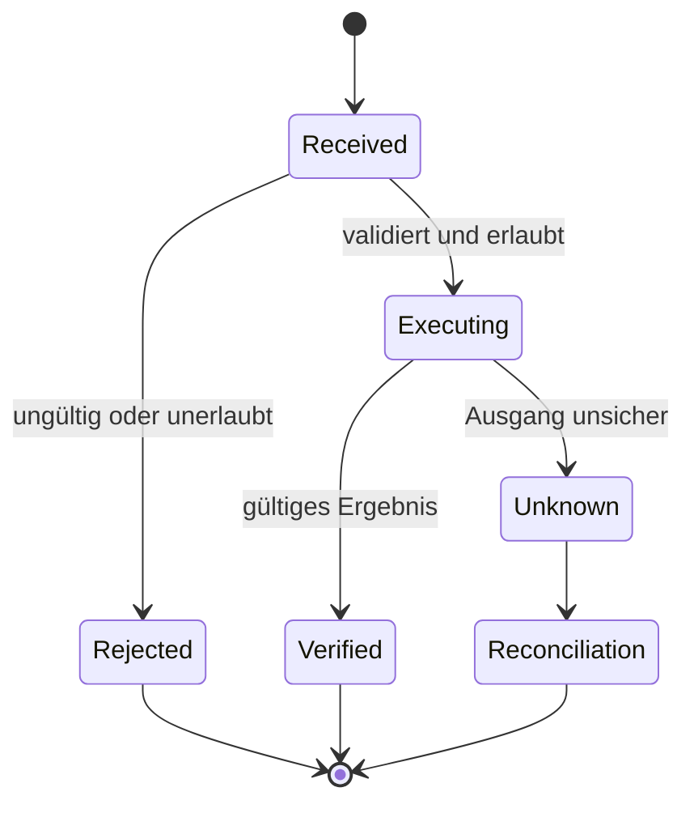

# Beispiel 02 — Resultate richtig zuordnen

## Inhalt

Zwei Calls sind gültig, einer davon verweist auf ein fehlendes Issue.
Ein Fehler ist trotzdem ein korreliertes Resultat und darf nicht verschwinden.

```json
[
  {"call_id":"a","name":"get_issue","arguments":{"repository":"training/demo","issue_id":1}},
  {"call_id":"b","name":"get_issue","arguments":{"repository":"training/demo","issue_id":999}}
]
```

Resultat b:

```json
{
  "call_id": "b",
  "status": "error",
  "error": {"code": "NOT_FOUND", "retryable": false}
}
```

Der Host überführt dies in das konkrete Toolresultat-Format seines Adapters.
Ein freier Assistant-Satz „Issue nicht gefunden“ ohne referenzierbare ID ist
kein gleichwertiger Transportvertrag.

## Zustandsdiagramm eines einzelnen Aufrufs



Rejected bedeutet nicht ausgeführt. Unknown bedeutet ausdrücklich nicht,
dass keine Wirkung eingetreten ist. Die Runtime darf Unknown nicht auf
Rejected reduzieren, nur weil eine Erfolgsantwort fehlt.

## Grenzen im Batch

Mehr als vier Calls werden im Labor vollständig vor Ausführung abgewiesen.
Dasselbe gilt für doppelte IDs oder ungültige Envelopes. Fachlich gültige,
unabhängige Calls werden danach sequenziell bearbeitet; ein Fehler eines Calls
rollt frühere Erfolge nicht zurück. Der Batch ist keine atomare Transaktion.

## Lernkontrolle

Nenne eine Operation, die erst nach erfolgreichem Read möglich wird. Begründe,
warum du sie nicht zusammen mit diesem Read parallel ausführst.
