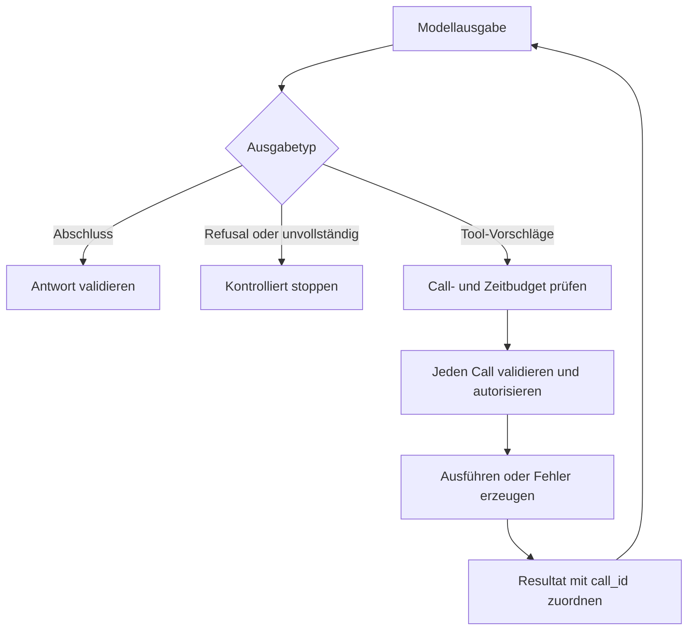

# 04 — Der kontrollierte Tool-Calling-Lifecycle

## 1. Inhalt

Ein Tool Call hat mindestens einen Namen, Argumente und eine Aufruf-ID.
Diese ID verbindet Vorschlag und Ergebnis. Sie ist keine fachliche Operation-ID
und kein Idempotenzschlüssel. Zwei Versuche derselben Mutation können
unterschiedliche Call-IDs haben und trotzdem dieselbe Operation repräsentieren.

## 2. Ablauf und Stopbedingungen



Die Schleife braucht begrenzte Schritte, Aufrufe, Kontextmenge und Laufzeit.
Ein Modell kann denselben unerlaubten Vorschlag wiederholen; die Anwendung darf
nicht endlos Fehler zurückfüttern. Ein Schemafehler kann höchstens eine bewusst
begrenzte Korrekturrunde auslösen. Ein Authfehler darf nicht zum Probieren eines
mächtigeren Tools führen.

## 3. Vollständiger Austausch

```json
{"call_id":"c-17","name":"get_issue","arguments":{"repository":"training/demo","issue_id":1}}
```

Die Hostantwort lautet im Erfolg sinngemäß:

```json
{"call_id":"c-17","status":"ok","data":{"issue_id":1,"title":"Healthcheck fehlt","body":"Demo","state":"open","version":1,"comments":[]}}
```

Dies ist die lokale IR des Labors. Ein SDK-Adapter übersetzt die IR in das
jeweilige Nachrichtenformat. Er muss die ursprüngliche Aufruf-ID erhalten und
darf ein Toolresultat nicht als hochpriorisierte Systeminstruktion einspeisen.

## 4. Streaming, mehrere Calls und Abhängigkeiten

Streaming-Argumente können vorübergehend ungültiges JSON sein. Erst die vollständig
empfangene und validierte Nachricht darf ausgeführt werden. Ein Zeitlimit oder
Abbruch vor Abschluss bedeutet: keine Ausführung aus diesem Fragment.

Mehrere unabhängige READ-Calls sind prinzipiell parallelisierbar. Ein Update, das
von einem vorherigen Read abhängt, ist es nicht. Parallel angekommene Resultate
werden anhand der Call-ID zugeordnet, nicht anhand ihrer Ankunftsreihenfolge.
Doppelte Call-IDs innerhalb eines Batches werden abgewiesen.

## 5. Was die Referenz tatsächlich implementiert

Der lokale `run_batch` verarbeitet einen fertig vorliegenden Batch sequenziell,
akzeptiert höchstens vier Calls und prüft dessen IDs vor der Ausführung.
Er ist kein LLM-Client und kein vollständiger Agent Loop. Das über mehrere
Modellrunden globale Budget entwirfst du in Übung 03. Dadurch bleiben
Protokollübertragung, Modellqualität und Executor-Sicherheit separat überprüfbar.

## 6. Lernziel

Zeichne Read → Update → Resultat mit zwei Call-IDs und einer fachlichen Operation.
Markiere Modellgrenze, Hostgrenze und Backendgrenze. Nenne das Verhalten bei
Refusal, Fragment, unbekanntem Tool, doppelter ID und ausgeschöpftem Budget.
