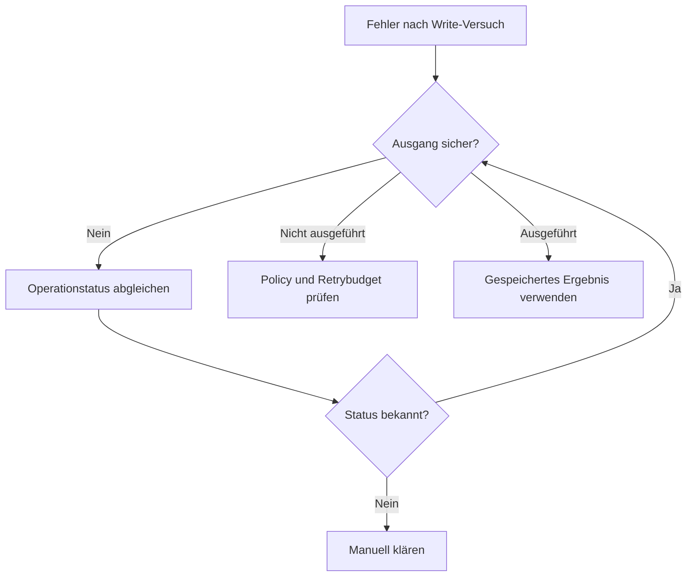

# 07 — Idempotenz, Retries und unsichere Ausgänge

## 1. Inhalt

Ein Netzwerkfehler sagt nicht zuverlässig, ob das Backend bereits geschrieben
hat. „Timeout“ bedeutet deshalb nicht automatisch „erneut senden“.
Idempotenz beschreibt gleiche beabsichtigte Wirkung bei Wiederholung.
Die HTTP-Semantik unterscheidet das von identischen Antworten;
GET/PUT/DELETE und POST haben unterschiedliche Standardsemantiken.
[RFC 9110, Abschnitt 9.2.2](https://www.rfc-editor.org/rfc/rfc9110.html#name-idempotent-methods).

Der Toolname ist kein HTTP-Verb. Ob `create_issue` sicher wiederholt werden darf,
ergibt sich aus dem vollständigen Backendvertrag, nicht aus dem Modelltext.

## 2. Drei IDs auseinanderhalten

| ID | Lebensdauer | Zweck |
|---|---|---|
| call_id | Ein Vorschlag/Aufrufversuch | Toolresultat zuordnen |
| idempotency_key | Eine beabsichtigte Mutation | Wiederholung deduplizieren |
| issue_id + expected_version | Ressource und gelesener Zustand | Lost Updates verhindern |

Der Host vergibt einen Key für eine Operation und behält ihn über deren Retries
bei. Ein neuer Key bei jedem Retry würde Deduplizierung aushebeln. Ein neues
fachliches Anliegen bekommt einen neuen Key.

## 3. Referenzverfahren

Der Host speichert unter (Principal, Repository, Tool, Key) einen Fingerprint und
das validierte Ergebnis. Gleicher Key und gleiche Argumente liefern das gespeicherte
Resultat mit der **neuen** call_id zurück, ohne erneut zu schreiben.
Gleicher Key mit anderen Argumenten liefert IDEMPOTENCY_CONFLICT.

Vor der Ausführung wird ein „pending/unknown“-Eintrag angelegt. Scheitert der
Handler unerwartet oder ist sein Output ungültig, bleibt dieser Eintrag stehen.
Ein Retry kann dann nicht versehentlich einen zweiten Write erzeugen. Bekannte
Fachfehler vor einer Mutation, etwa VERSION_CONFLICT, entfernen den Pending-Eintrag.

Das ist eine sequenzielle In-Memory-Demonstration. Ein Crash verliert das Journal.
Mehrere Prozesse und atomare Backendtransaktionen sind nicht implementiert.
Das Labor darf nicht als verteilte Exactly-once-Lösung bezeichnet werden.

## 4. Optimistic Concurrency

Ein Issue hat Version 3. Zwei Clients lesen diese Version. Client A schreibt mit
`expected_version: 3`, der Zustand wird Version 4. Client B schreibt ebenfalls
gegen Version 3 und erhält VERSION_CONFLICT. Er muss neu lesen und fachlich
entscheiden, statt A stillschweigend zu überschreiben.

Bei einem echten Backend gehört diese Prüfung atomar an die Mutation, z.B.
als Versionsvergleich in der Datenbank oder bedingter HTTP-Request. Ein Read,
ein Vergleich im Client und ein späterer unbedingter Write wären race-anfällig.

## 5. Retry-Entscheidung

Für einen retrybaren Read kann begrenztes Backoff mit Jitter sinnvoll sein.
Zeitbudget, Maximalversuche und Backendhinweise begrenzen ihn. Für Writes müssen
zusätzlich Idempotenz und tatsächlicher Ausgang geklärt sein.

## 6. Lernziel

[Übung 05](../exercises/05-reliability/README.md) lässt dich vier Situationen
unterscheiden: identische Wiederholung, Key-Missbrauch, Versionskonflikt und
verlorene Antwort nach Mutation. Zu jeder dokumentierst du Zustand, Resultat und
zulässigen nächsten Schritt.
